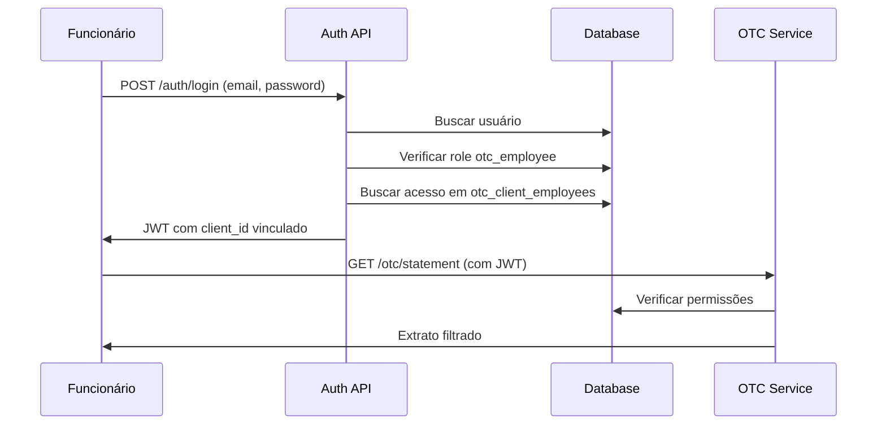

# 📋 Estudo: Sistema de Funcionários para Clientes OTC

## 🎯 Objetivo

Implementar um sistema que permita aos clientes OTC conceder acesso limitado a seus funcionários, onde estes poderão visualizar o extrato do cliente com restrições específicas de informação.

---

## 📊 Situação Atual

### Estrutura de Usuários Existente
```
┌─────────────┐    ┌──────────────┐    ┌─────────────┐
│   users     │    │  user_roles  │    │   roles     │
├─────────────┤    ├──────────────┤    ├─────────────┤
│ id          │◄──►│ user_id      │    │ id          │
│ name        │    │ role_id      │◄──►│ name        │
│ email       │    │ created_at   │    │ description │
│ password    │    │ updated_at   │    └─────────────┘
│ ...         │    └──────────────┘
└─────────────┘
       │
       ▼
┌─────────────┐
│ otc_clients │
├─────────────┤
│ id          │
│ user_id     │ ◄── FK para users
│ client_name │
│ pix_key     │
│ ...         │
└─────────────┘
```

### Roles Identificadas
- **Admin**: Acesso completo ao sistema
- **OTC Client**: Acesso ao próprio extrato (role_id: 2)

### Funcionalidades OTC Atuais
- Visualização completa do extrato
- Saldos BRL e USD
- Histórico de transações
- Operações manuais
- Conferência de registros

---

## 🚀 Nova Necessidade: Funcionários OTC

### Cenário de Uso
```
Cliente OTC (Empresa X)
    ↓
Funcionário A ── Acesso limitado ao extrato da Empresa X
Funcionário B ── Acesso limitado ao extrato da Empresa X
Funcionário C ── Acesso limitado ao extrato da Empresa X
```

### Restrições para Funcionários
- ❌ **Não ver saldos** (BRL e USD)
- ❌ **Não ver operações manuais** (créditos/débitos admin)
- ❌ **Não ver conversões** BRL ↔ USD
- ❌ **Não ver histórico de saldo**
- ✅ **Ver APENAS depósitos PIX automáticos**
- ✅ **Ver data, valor e pagador** dos depósitos
- ✅ **Interface clean** sem informações sensíveis

---

## 🏗️ Arquitetura Proposta

### 1. Nova Role: `otc_employee`
```sql
INSERT INTO roles (name, description) VALUES 
('otc_employee', 'Funcionário de cliente OTC com acesso limitado');
```

### 2. Nova Tabela: `otc_client_employees` (Simplificada)
```sql
CREATE TABLE otc_client_employees (
  id INT AUTO_INCREMENT PRIMARY KEY,
  otc_client_id INT NOT NULL,
  employee_user_id INT NOT NULL,
  granted_by_user_id INT NOT NULL,
  is_active BOOLEAN DEFAULT TRUE,
  granted_at TIMESTAMP DEFAULT CURRENT_TIMESTAMP,
  created_at TIMESTAMP DEFAULT CURRENT_TIMESTAMP,
  updated_at TIMESTAMP DEFAULT CURRENT_TIMESTAMP ON UPDATE CURRENT_TIMESTAMP,
  
  FOREIGN KEY (otc_client_id) REFERENCES otc_clients(id),
  FOREIGN KEY (employee_user_id) REFERENCES users(id),
  FOREIGN KEY (granted_by_user_id) REFERENCES users(id),
  
  UNIQUE KEY unique_employee_client (otc_client_id, employee_user_id),
  INDEX idx_employee_user (employee_user_id),
  INDEX idx_otc_client (otc_client_id)
);
```

**Campos removidos (simplificação):**
- `access_level` → Todos têm o mesmo acesso básico
- `expires_at` → Acessos permanentes (podem ser revogados manualmente)
```

### 3. Schema Prisma Atualizado (Simplificado)
```prisma
model otc_client_employees {
  id                 Int       @id @default(autoincrement())
  otc_client_id      Int
  employee_user_id   Int
  granted_by_user_id Int
  is_active          Boolean   @default(true)
  granted_at         DateTime  @default(now())
  created_at         DateTime  @default(now())
  updated_at         DateTime  @updatedAt

  // Relacionamentos
  otc_client       otc_clients @relation(fields: [otc_client_id], references: [id])
  employee_user    User        @relation("EmployeeUser", fields: [employee_user_id], references: [id])
  granted_by_user  User        @relation("GrantedByUser", fields: [granted_by_user_id], references: [id])

  @@unique([otc_client_id, employee_user_id], map: "unique_employee_client")
  @@index([employee_user_id], map: "idx_employee_user")
  @@index([otc_client_id], map: "idx_otc_client")
}
```

---

## 🔐 Sistema de Autenticação e Autorização

### Fluxo de Login para Funcionários


### Token JWT Estendido (Simplificado)
```javascript
// Token atual
{
  id: user_id,
  email: "user@example.com",
  roles: ["otc_client"]
}

// Token para funcionário (simplificado)
{
  id: user_id,
  email: "funcionario@exemplo.com", 
  roles: ["otc_employee"],
  otc_client_access: {
    client_id: 123
    // Sem access_level ou expires_at - todos têm acesso básico uniforme
  }
}
```

---

## 📱 Modificações no Backend

### 1. Auth Service - Novas Funções
```javascript
// BMP/config/auth/auth.service.js

/**
 * Verificar se usuário é funcionário OTC e obter acesso
 */
async getOTCEmployeeAccess(userId) {
  const access = await prisma.otc_client_employees.findFirst({
    where: {
      employee_user_id: userId,
      is_active: true,
      OR: [
        { expires_at: null },
        { expires_at: { gt: new Date() } }
      ]
    },
    include: {
      otc_client: {
        select: {
          id: true,
          client_name: true,
          client_document: true
        }
      }
    }
  });
  
  return access;
}

/**
 * Login modificado para incluir dados de funcionário OTC
 */
async loginUser({ email, password }) {
  // ... código existente ...
  
  // Verificar se é funcionário OTC
  if (user.user_roles.some(role => role.roles.name === 'otc_employee')) {
    const otcAccess = await this.getOTCEmployeeAccess(user.id);
    if (otcAccess) {
      userWithoutPassword.otc_client_access = {
        client_id: otcAccess.otc_client_id,
        client_name: otcAccess.otc_client.client_name,
        access_level: otcAccess.access_level,
        expires_at: otcAccess.expires_at
      };
    }
  }
  
  return { user: userWithoutPassword, token };
}
```

### 2. OTC Service - Método Filtrado
```javascript
// otc/otc.service.js

/**
 * Obter extrato filtrado para funcionários (Simplificado)
 */
async getEmployeeStatement(employeeUserId, filtros = {}) {
  // Verificar acesso do funcionário
  const access = await this.getEmployeeAccess(employeeUserId);
  if (!access) {
    throw new Error('Funcionário não tem acesso a nenhum cliente OTC');
  }

  // Buscar extrato do cliente com filtros aplicados
  const statement = await this.getClientStatement(access.otc_client_id, filtros);
  
  // Aplicar filtros básicos para funcionários
  return this.applyEmployeeFilters(statement);
}

/**
 * Aplicar filtros básicos para funcionários
 */
applyEmployeeFilters(statement) {
  const filtered = { ...statement };
  
  // 🚫 Ocultar todos os saldos
  filtered.cliente.current_balance = null;
  filtered.cliente.usd_balance = null;
  filtered.cliente.last_conversion_rate = null;
  
  // 🚫 Filtrar transações - APENAS depósitos PIX automáticos
  filtered.transacoes = statement.transacoes.filter(tx => 
    tx.type === 'deposit' && // Apenas depósitos
    !tx.notes?.includes('manual') && // Sem operações manuais
    !tx.notes?.includes('conversão') // Sem conversões
  ).map(tx => ({
    id: tx.id,
    type: tx.type,
    amount: tx.amount, // ✅ Mostra valores dos depósitos
    date: tx.date,
    status: tx.status,
    payer_name: tx.payer_name,
    payer_document: tx.payer_document,
    bmp_identifier: tx.bmp_identifier
    // 🚫 Sem processed_by, notes detalhadas, etc
  }));
  
  // 🚫 Sem histórico de saldo (removido completamente)
  filtered.historico_saldo = [];
  
  return filtered;
}
```

### 3. Middleware de Autorização
```javascript
// middleware/otc-employee.middleware.js

const otcEmployeeMiddleware = async (req, res, next) => {
  try {
    const user = req.user; // Vem do authMiddleware
    
    // Verificar se tem role de funcionário OTC
    const hasEmployeeRole = user.user_roles?.some(role => 
      role.roles?.name === 'otc_employee'
    );
    
    if (!hasEmployeeRole) {
      return res.status(403).json({
        sucesso: false,
        mensagem: 'Acesso negado: usuário não é funcionário OTC'
      });
    }
    
    // Verificar acesso ativo ao cliente (simplificado)
    const access = await prisma.otc_client_employees.findFirst({
      where: {
        employee_user_id: user.id,
        is_active: true
        // Sem verificação de expires_at - acessos são permanentes até serem revogados
      }
    });
    
    if (!access) {
      return res.status(403).json({
        sucesso: false,
        mensagem: 'Acesso ao cliente OTC expirado ou inativo'
      });
    }
    
    // Adicionar dados de acesso ao request
    req.otcAccess = access;
    next();
    
  } catch (error) {
    console.error('[OTC EMPLOYEE MIDDLEWARE] Erro:', error);
    return res.status(500).json({
      sucesso: false,
      mensagem: 'Erro interno do servidor'
    });
  }
};

module.exports = otcEmployeeMiddleware;
```

---

## 🌐 Modificações no Frontend

### **Análise da Estrutura Atual**

O frontend está bem estruturado com:
- **Roteamento unificado** em `App.tsx`
- **ProtectedRoute** com `requireAdmin` 
- **UserTypeService** detectando tipos via `/api/auth/user-type`
- **ClientStatement** para clientes OTC (completo)
- **Componentes OTC** reutilizáveis

### **Arquivos Existentes Analisados**
```
App.tsx                    # Roteamento principal ✅
ClientStatement.tsx        # Tela atual do cliente OTC ✅
ProtectedRoute.tsx         # Proteção de rotas ✅
UserTypeService.ts         # Detecção de tipos ✅
OTCStatementModal.tsx      # Modal de extrato ✅
services/otc.ts           # APIs OTC ✅
```

### 1. Modificações em Arquivos Existentes

#### **App.tsx** - Nova Rota
```jsx
// ADICIONAR após linha 113:
<Route path="/employee-statement" element={
  <ProtectedRoute requireEmployee={true}>
    <EmployeeStatement />
  </ProtectedRoute>
} />
```

#### **ProtectedRoute.tsx** - Nova Props
```jsx
interface ProtectedRouteProps {
  children: ReactNode;
  redirectTo?: string;
  requireAdmin?: boolean;
  requireEmployee?: boolean; // NOVA PROP
}

// Adicionar lógica para verificar funcionário:
if (requireEmployee && !userTypeResult.isEmployee) {
  return <Navigate to={redirectTo} replace />;
}
```

#### **UserTypeService.ts** - Detectar Funcionário
```javascript
// Modificar interface UserTypeResult (simplificada):
interface UserTypeResult {
  type: 'admin' | 'otc_client' | 'otc_employee';
  isOTC: boolean;
  isAdmin: boolean;
  isEmployee?: boolean; // NOVO
  otcAccess?: {         // NOVO (simplificado)
    client_id: number;
    client_name: string;
    // Sem access_level ou expires_at
  };
}

// Modificar checkUserType:
const { type, isAdmin, isOTCClient, isOTCEmployee, otcAccess } = response.data;

return {
  type,
  isOTC: isOTCClient,
  isAdmin,
  isEmployee: isOTCEmployee, // NOVO
  otcAccess              // NOVO (dados básicos apenas)
};
```

### 2. Novos Arquivos

#### **pages/EmployeeStatement.tsx** (baseado em ClientStatement.tsx)
```jsx
// Versão simplificada da ClientStatement atual
// Principais diferenças:
// - Não busca todos os clientes (usa otcAccess do JWT)
// - UI sem saldos (current_balance, usd_balance = null)
// - Sem operações manuais nos filtros
// - Componente de aviso sobre limitações

const EmployeeStatement: React.FC = () => {
  const { user } = useAuth();
  const [data, setData] = useState<EmployeeStatementData | null>(null);
  
  // Usar user.otcAccess em vez de buscar clientes
  const clientId = user?.otcAccess?.client_id;
  // Sem accessLevel - todos têm o mesmo acesso básico
  
  // Buscar extrato filtrado via API específica
  const fetchEmployeeStatement = async () => {
    const response = await employeeService.getStatement();
    // Dados já vêm filtrados do backend
  };
}
```

#### **components/employee/EmployeeStatementView.tsx**
```jsx
// Baseado no OTCStatementModal atual, mas adaptado:
interface EmployeeStatementViewProps {
  clientData: {
    id: number;
    name: string;
    document: string;
    pix_key: string;
    // current_balance: omitido
    // usd_balance: omitido
  };
  transactions: FilteredTransaction[];
  // Sem accessLevel - todos têm acesso básico uniforme
}

export function EmployeeStatementView({ 
  clientData, 
  transactions 
}: EmployeeStatementViewProps) {
  return (
    <div className="employee-statement">
      {/* Header sem saldos */}
      <Card>
        <CardHeader>
          <h2>Extrato - {clientData.name}</h2>
          <Badge variant="outline">Funcionário</Badge>
        </CardHeader>
        <CardContent>
          <div className="grid gap-4">
            <div>
              <Label>Documento</Label>
              <p>{clientData.document}</p>
            </div>
            <div>
              <Label>Chave PIX</Label>
              <p>{clientData.pix_key}</p>
            </div>
            
            {/* Aviso sobre saldos ocultos */}
            <div className="bg-muted p-3 rounded">
              <p className="text-sm text-muted-foreground">
                💼 Saldos disponíveis apenas para o titular da conta
              </p>
            </div>
          </div>
        </CardContent>
      </Card>
      
      {/* Tabela de transações filtradas */}
      <Card>
        <CardHeader>
          <h3>Transações</h3>
        </CardHeader>
        <CardContent>
          <Table>
            <TableHeader>
              <TableRow>
                <TableHead>Data</TableHead>
                <TableHead>Tipo</TableHead>
                <TableHead>Valor</TableHead>
                <TableHead>Status</TableHead>
                <TableHead>Pagador</TableHead>
              </TableRow>
            </TableHeader>
            <TableBody>
              {transactions.map(tx => (
                <TableRow key={tx.id}>
                  <TableCell>{formatDate(tx.date)}</TableCell>
                  <TableCell>
                    <Badge variant="outline">Depósito PIX</Badge>
                  </TableCell>
                  <TableCell>
                    {formatCurrency(tx.amount)}
                  </TableCell>
                  <TableCell>
                    <Badge variant={tx.status === 'processed' ? 'default' : 'destructive'}>
                      {tx.status}
                    </Badge>
                  </TableCell>
                  <TableCell>{tx.payer_name || '-'}</TableCell>
                </TableRow>
              ))}
            </TableBody>
          </Table>
        </CardContent>
      </Card>
      
      {/* Nota sobre limitações */}
      <div className="mt-4 p-4 bg-orange-50 border border-orange-200 rounded">
        <div className="flex items-center gap-2">
          <AlertTriangle className="h-4 w-4 text-orange-600" />
          <p className="text-sm text-orange-800">
            Visualização limitada para funcionários. Para informações completas, 
            entre em contato com o titular da conta.
          </p>
        </div>
      </div>
    </div>
  );
}
```

#### **services/employee.ts**
```javascript
class EmployeeService {
  private baseURL = '/api/otc/employee';
  
  async getStatement(filters?: any) {
    const response = await api.get(`${this.baseURL}/statement`, {
      params: filters
    });
    return response.data;
  }
}

export const employeeService = new EmployeeService();
```

#### **types/employee.ts** (Simplificado)
```typescript
export interface EmployeeAccess {
  client_id: number;
  client_name: string;
  // Sem access_level ou expires_at - acesso básico uniforme
}

export interface EmployeeStatementData {
  cliente: {
    id: number;
    name: string;
    document: string;
    pix_key: string;
    // Sem current_balance e usd_balance
  };
  transacoes: FilteredOTCTransaction[];
  // Sem historico_saldo - removido completamente
}

export interface FilteredOTCTransaction {
  id: number;
  type: 'deposit'; // Apenas depósitos PIX
  amount: number; // Sempre mostra valores dos depósitos
  date: string;
  status: string;
  payer_name?: string;
  payer_document?: string;
  bmp_identifier?: string;
  // Sem processed_by, notes, conversões, etc
}
```

### 3. Reutilização de Componentes Existentes

**Componentes que PODEM ser reutilizados sem modificação:**
- ✅ `Card`, `Button`, `Input`, `Table` (UI básica)
- ✅ `Badge`, `Label`, `Skeleton` (componentes visuais)
- ✅ `formatCurrency`, `formatDate` (utils)
- ✅ `toast` (notificações)
- ✅ Filtros de data e busca (lógica de filtro)

**Componentes que PRECISAM de adaptação:**
- ⚠️ `OTCStatementModal` → Versão para funcionários
- ⚠️ Headers com saldos → Omitir informações sensíveis
- ⚠️ Tabelas → Ocultar colunas específicas

### 4. Fluxo de Navegação Atualizado

```mermaid
graph TD
    A[Login /login] --> B{Tipo de Usuário}
    B -->|Admin| C[Dashboard Admin]
    B -->|Cliente OTC| D[/client-statement]
    B -->|Funcionário OTC| E[/employee-statement]
    
    C --> F[Painel Completo]
    D --> G[Extrato Completo]
    E --> H[Extrato Limitado]
    
    F --> I[Sistema OTC]
    I --> J[Novo Cliente]
    I --> K[Funcionários OTC]
    
    G --> L[Saldos + Operações + Conversões]
    H --> M[Apenas Depósitos PIX]
### 5. Interface Admin - Gerenciamento de Funcionários

#### **Localização do Botão**
Na página `/otc` (OTCClients.tsx), ao lado do botão "Novo Cliente":

```jsx
{/* Cabeçalho da página OTC */}
<div className="flex justify-between items-center">
  <div>
    <h1 className="text-3xl font-bold text-foreground">Sistema OTC</h1>
    <p className="text-muted-foreground">Gerenciamento de clientes Over-the-Counter</p>
  </div>
  
  {/* Grupo de botões */}
  <div className="flex gap-3">
    <Button 
      onClick={handleNewClient}
      className="bg-blue-600 hover:bg-blue-700"
    >
      <Plus className="w-4 h-4 mr-2" />
      Novo Cliente
    </Button>
    
    {/* NOVO BOTÃO */}
    <Button 
      onClick={handleManageEmployees}
      variant="outline"
      className="border-purple-600 text-purple-600 hover:bg-purple-50"
    >
      <Users className="w-4 h-4 mr-2" />
      Funcionários OTC
    </Button>
  </div>
</div>
```

#### **Principais Funcionalidades do Modal**

1. **Aba "Criar Funcionário"** (Simplificada):
   - Formulário para dados do funcionário (nome, email, senha)
   - Seleção do cliente OTC que terá acesso
   - Criação com acesso básico uniforme (sem configuração)

2. **Aba "Gerenciar Acessos"** (Simplificada):
   - Lista de funcionários por cliente selecionado
   - Visualização de status (ativo/inativo)
   - Ações para revogar acesso
   - Interface intuitiva com badges simples

#### **Fluxo de Criação**
```
Admin clica "Funcionários OTC" → Modal abre → Aba "Criar" → 
Preenche dados → Seleciona cliente → 
Clica "Criar Funcionário" → Sistema cria usuário + vincula cliente
```

#### **Benefícios da Abordagem**
- ✅ **Integração natural** com interface existente
- ✅ **Padrão visual** consistente com botão "Novo Cliente"
- ✅ **Workflow centralizado** em um único modal
- ✅ **Gerenciamento completo** sem sair da página OTC
- ✅ **UX intuitiva** para administradores

---

## 📋 APIs Necessárias

### 1. Gerenciamento de Funcionários (Admin)
```javascript
// routes/otc-employees.routes.js

/**
 * @route POST /api/otc/employees
 * @desc Criar funcionário para cliente OTC
 * @access Admin
 */
router.post('/', authMiddleware, adminMiddleware, async (req, res) => {
  // Criar usuário funcionário e vincular ao cliente
});

/**
 * @route GET /api/otc/employees/:clientId
 * @desc Listar funcionários de um cliente OTC
 * @access Admin ou OTC Client
 */
router.get('/:clientId', authMiddleware, async (req, res) => {
  // Listar funcionários vinculados
});

/**
 * @route PUT /api/otc/employees/:employeeId/access
 * @desc Atualizar nível de acesso do funcionário
 * @access Admin ou OTC Client
 */
router.put('/:employeeId/access', authMiddleware, async (req, res) => {
  // Atualizar nível de acesso
});

/**
 * @route DELETE /api/otc/employees/:employeeId
 * @desc Revogar acesso do funcionário
 * @access Admin ou OTC Client
 */
router.delete('/:employeeId', authMiddleware, async (req, res) => {
  // Revogar acesso (is_active = false)
});
```

### 2. Extrato para Funcionários
```javascript
// routes/otc-employee-statement.routes.js

/**
 * @route GET /api/otc/employee/statement
 * @desc Obter extrato limitado para funcionário
 * @access OTC Employee
 */
router.get('/statement', 
  authMiddleware, 
  otcEmployeeMiddleware, 
  async (req, res) => {
    // Retornar extrato filtrado
  }
);
```

---

## 🔧 Implementação por Fases

### **📊 Resumo de Impacto Simplificado**
```
Backend (BaaS-Nexus1):
  📁 Novos: 3 arquivos (routes + middleware + auth updates)
  📝 Modificados: 3 arquivos (otc.service.js + auth.service.js + prisma)
  🗄️ Banco: 1 nova tabela (simplificada) + 1 nova role

Frontend (deposit-sync-oracle):
  📁 Novos: 4 arquivos (página + componente + service + types)
  📝 Modificados: 3 arquivos (App.tsx + ProtectedRoute + UserTypeService)
  🎨 UI: 80% reutilização (interface mais simples)
  
Admin UX:
  🎯 Botão "Funcionários OTC" ao lado de "Novo Cliente"
  📋 Modal simplificado: Criar + Listar
  ⚡ Implementação direta sem configurações complexas
```

### Fase 1: Estrutura Base (Backend)
- [ ] **Banco**: Criar nova role `otc_employee` → Script criado: `sql-scripts/funcionarios_otc_setup.sql`
- [ ] **Banco**: Criar tabela `otc_client_employees` → Script criado: `sql-scripts/funcionarios_otc_setup.sql`
- [x] **Prisma**: Atualizar schema Prisma → **CONCLUÍDO** (modelo otc_client_employees adicionado)
- [ ] **Migração**: Executar migração do banco de dados → Aguardando execução manual

### Fase 2: Backend - Autenticação
- [x] **Auth**: Modificar `auth.service.js` para funcionários → **CONCLUÍDO** (funções getOTCEmployeeAccess, isUserOTCEmployee, getUserType modificada)
- [x] **Middleware**: Criar `otc-employee.middleware.js` → **CONCLUÍDO** (middleware completo + versão simplificada)
- [x] **Service**: Implementar `getEmployeeAccess` → **CONCLUÍDO** (integrado no auth.service.js)
- [ ] **Testes**: Validar autenticação → Aguardando execução dos scripts SQL

### Fase 3: Backend - APIs de Funcionários
- [x] **Routes**: Criar `otc-employees.routes.js` → **CONCLUÍDO** (rotas completas de gerenciamento)
- [x] **CRUD**: Implementar gerenciamento de funcionários → **CONCLUÍDO** (otc-employees.controller.js)
- [x] **Validação**: Regras de segurança → **CONCLUÍDO** (validações integradas no controller)
- [ ] **Testes**: APIs de funcionários → Aguardando execução dos scripts SQL

### Fase 4: Backend - Extrato Filtrado
- [x] **Service**: Implementar `getEmployeeStatement` → **CONCLUÍDO** (integrado no otc.service.js)
- [x] **Filter**: Criar `applyEmployeeFilters` → **CONCLUÍDO** (filtros integrados na função)
- [x] **Route**: API `GET /api/otc/employee/statement` → **CONCLUÍDO** (otc-employee-statement.routes.js)
- [ ] **Testes**: Verificar filtragem → Aguardando execução dos scripts SQL

### Fase 5: Frontend - Estrutura
- [x] **Routes**: Modificar `App.tsx` (nova rota) → **CONCLUÍDO** (rota /employee-statement adicionada)
- [x] **Auth**: Atualizar `ProtectedRoute.tsx` → **CONCLUÍDO** (suporte a requireEmployee)
- [x] **Types**: Modificar `UserTypeService.ts` → **CONCLUÍDO** (suporte a otc_employee)
- [ ] **Types**: Criar interfaces em `types/employee.ts` → **OPCIONAL** (tipos integrados na página)

### Fase 6: Frontend - Componentes
- [x] **Page**: Criar `EmployeeStatement.tsx` → **CONCLUÍDO** (página completa com filtros e limitações)
- [ ] **Component**: Criar `EmployeeStatementView.tsx` → **DESNECESSÁRIO** (integrado na página principal)
- [ ] **Service**: Criar `services/employee.ts` → **DESNECESSÁRIO** (API integrada na página)
- [ ] **Header**: Criar `EmployeeHeader.tsx` → **DESNECESSÁRIO** (header integrado na página)

### Fase 7: Frontend - UX/UI
- [x] **Design**: Layout específico para funcionários → **CONCLUÍDO** (interface clean na EmployeeStatement.tsx)
- [x] **Feedback**: Avisos sobre limitações → **CONCLUÍDO** (alertas sobre acesso limitado)
- [x] **Responsive**: Adaptação mobile → **CONCLUÍDO** (grid responsivo)
- [x] **A11y**: Acessibilidade → **CONCLUÍDO** (labels, roles, estrutura semântica)

### Fase 8: Admin - Gerenciamento de Funcionários
- [x] **UI**: Botão "Funcionários OTC" na página OTCClients → **CONCLUÍDO** (botão roxo ao lado de "Novo Cliente")
- [x] **Modal**: Criar funcionário (OTCEmployeeModal) → **CONCLUÍDO** (modal completo com duas abas)
- [x] **Lista**: Visualizar funcionários de um cliente → **CONCLUÍDO** (tabela com filtro por cliente)
- [x] **Permissões**: Controle de níveis de acesso → **CONCLUÍDO** (ativar/desativar funcionários)
- [x] **Auditoria**: Logs de criação/revogação → **CONCLUÍDO** (backend registra tudo)

### Fase 9: Testes e Deploy
- [ ] **E2E**: Testes end-to-end
- [ ] **Security**: Penetration testing
- [ ] **Performance**: Load testing
- [ ] **Deploy**: Produção

---

## 🛡️ Considerações de Segurança

### Validações Obrigatórias
1. **Token JWT deve incluir client_id** para funcionários
2. **Middleware específico** para validar acesso ao cliente
3. **Filtros server-side** - nunca confiar no frontend
4. **Logs de acesso** para auditoria
5. **Expiração de acesso** configurável

### Prevenção de Vazamentos
1. **Saldos sempre null** para funcionários
2. **Operações manuais filtradas** no backend
3. **Informações sensíveis omitidas** do response
4. **Rate limiting** nas APIs de funcionários

---

## 📈 Métricas e Monitoramento

### Logs Importantes
- Acessos de funcionários ao extrato
- Tentativas de acesso não autorizado
- Modificações de permissões
- Expiração de acessos

### Alertas
- Múltiplos acessos simultâneos do mesmo funcionário
- Tentativas de acesso após expiração
- Alterações de permissões fora do horário comercial

---

## 🎯 Resultado Esperado

Um sistema que permita:

1. **Clientes OTC** concedam acesso limitado a funcionários
2. **Funcionários** vejam extratos com informações restritas
3. **Administradores** gerenciem facilmente essas permissões
4. **Auditoria completa** de todos os acessos
5. **Segurança robusta** contra vazamentos de informação

### Benefícios
- ✅ Transparência controlada para clientes
- ✅ Redução de consultas manuais
- ✅ Melhoria na experiência do cliente
- ✅ Manutenção da segurança dos dados
- ✅ Rastreabilidade completa

---

## 📝 **Resumo Executivo**

### **Problema Identificado**
Clientes OTC precisam dar acesso limitado ao extrato para seus funcionários, mas o sistema atual só permite acesso completo (cliente) ou nenhum acesso.

### **Solução Proposta (Simplificada)**
Sistema de funcionários OTC com acesso básico uniforme:
- **Acesso único**: Ver apenas depósitos PIX automáticos
- **Sem configurações**: Implementação direta e simples
- **Interface clean**: Apenas informações essenciais

### **Benefícios**
- ✅ **Transparência controlada** para funcionários
- ✅ **Redução de consultas manuais** ao suporte
- ✅ **Melhoria na experiência** do cliente
- ✅ **Segurança robusta** contra vazamentos
- ✅ **Auditoria completa** de todos os acessos

### **Esforço Estimado (Simplificado)**
```
Backend:   ~15 horas (banco + APIs básicas + auth)
Frontend:  ~12 horas (80% reutilização + interface simples)
Admin UX:  ~5 horas (botão + modal básico)
Testes:    ~8 horas (security + funcional)
TOTAL:     ~40 horas (~1 semana)
```

### **Impacto no Sistema**
- ✅ **Zero impact** nos usuários atuais
- ✅ **Reutilização máxima** do código existente
- ✅ **Escalável** para novos bancos/provedores
- ✅ **Mantém isolamento** BMP/Bitso

### **Próximos Passos**
1. **Aprovação** do estudo
2. **Implementação** Fase 1 (banco)
3. **Testes** em desenvolvimento
4. **Deploy** gradual

---

*Documento criado em: Janeiro 2025*  
*Status: ✅ Estudo completo com análise de frontend - Pronto para implementação*  
*Revisão: Incluída análise completa do frontend existente*